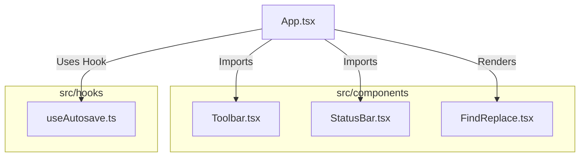

# 📝 Notepad Web App


A **lightweight and efficient Notepad Web App** built with **React (TSX), Vite, TailwindCSS**, and **TypeScript**. It includes essential text-editing features, a status bar, and auto-save functionality.

## 🚀 Features

✅ **Minimal & Fast** – Powered by **Vite** for blazing-fast performance.  
✅ **Find & Replace** – Quickly search and replace text.  
✅ **Autosave** – Never lose your work with automatic saving.  
✅ **Customizable UI** – Styled using **TailwindCSS** for a sleek experience.  
✅ **Status Bar** – Displays essential document information.  

---

## 📂 Project Structure

```bash
rajtilak-2020-notepad-web-app/
├── eslint.config.js        # ESLint configuration
├── index.html              # Main HTML file
├── package.json            # Project dependencies
├── postcss.config.js       # PostCSS configuration
├── tailwind.config.js      # TailwindCSS configuration
├── tsconfig.app.json       # TypeScript app config
├── tsconfig.json           # TypeScript base config
├── tsconfig.node.json      # TypeScript Node config
├── vite.config.ts          # Vite configuration
└── src/
    ├── App.tsx             # Main App component
    ├── index.css           # Global styles
    ├── main.tsx            # Entry point
    ├── types.ts            # Type definitions
    ├── vite-env.d.ts       # Vite environment types
    ├── components/
    │   ├── FindReplace.tsx  # Find & Replace feature
    │   ├── StatusBar.tsx    # Status bar component
    │   └── Toolbar.tsx      # Toolbar component
    └── hooks/
        └── useAutosave.ts   # Custom hook for autosave
```

---

## 📌 Architecture



---

## 🛠️ Installation & Usage

### 🔹 Prerequisites

Ensure you have **Node.js (>=16.0.0)** and **npm/yarn/pnpm** installed.

### 🔹 Install Dependencies

```bash
npm install  # or yarn install or pnpm install
```

### 🔹 Start Development Server

```bash
npm run dev  # or yarn dev or pnpm dev
```

---

## 🌟 Contributing

Contributions are welcome! Feel free to **fork** this repo, create a new branch, and submit a **Pull Request**.

---

## 📜 License

This project is **MIT Licensed**. Check [LICENSE](./LICENSE) for details.

---

💡 *Developed with ❤️ by [K Rajtilak](https://github.com/rajtilak-2020)*  

---
